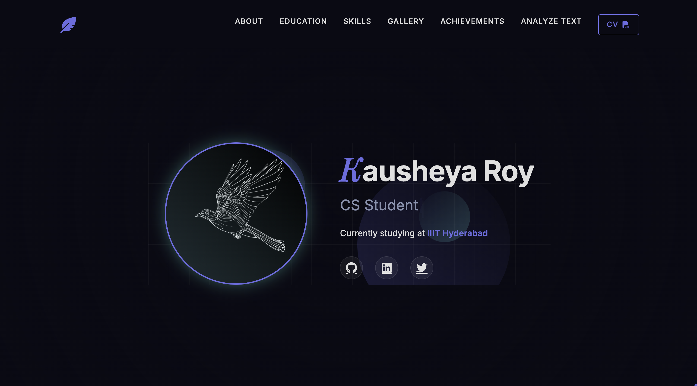
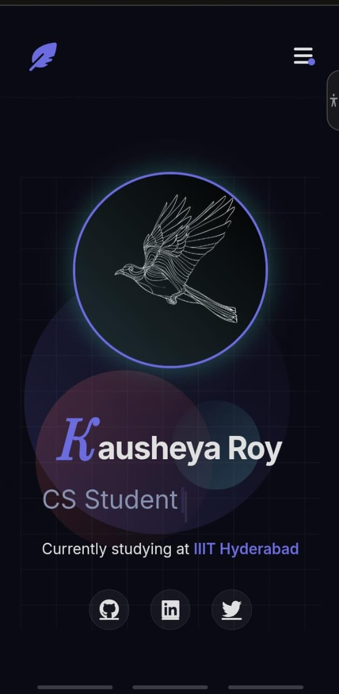

## LLM ChatHistory Link :

1. ChatGPT : https://chatgpt.com/share/67f22d15-6684-800d-aaa7-88b212fbd917

2. v0 : https://v0.dev/chat/portfolio-website-redesign-1uZRoJdezbU

## Hosted Link :

https://kausheya2006.github.io

## Screenshots

### Desktop View 

### Mobile View


## Assumptions

1. I have provided the link of the website in submission.txt

2. Click on ANALYZE TEXT tab for Qs 3 

3. This is my pronouns, prepositions, articles wordlist : (case insensitive)
```
    pronouns = ['i', 'you', 'he', 'she', 'it', 'we', 'they', 'me', 'him', 'her', 'us', 'them', 'my', 'your', 'his', 'our', 'their']
```
```
    prepositions = ['in', 'on', 'at', 'by', 'with', 'about', 'against', 'between', 'into', 'through', 'during', 'before', 'after', 'above', 'below', 'to', 'from', 'up', 'down', 'of', 'off', 'over', 'under']
```
```    
    articles = ['a', 'an', 'the']
```


